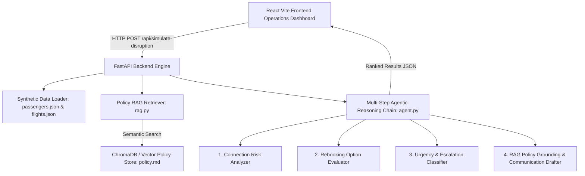

# Flight Disruption Agent — Autonomous Passenger Care & Rebooking Copilot

> **Internship Application Project for AIONOS**  
> *AIONOS is a joint venture between InterGlobe Enterprises (parent of IndiGo Airlines) and Assago Ventures building agentic AI products for travel, aviation, logistics, and hospitality.*

---

## 📌 Problem Statement & Overview
When flight disruptions (delays, severe weather, aircraft maintenance, cancellations) occur, airline operations teams must make rapid, high-stakes decisions for hundreds of passengers simultaneously. Evaluating individual connecting flight risks, assigning optimal rebooking options, identifying special assistance needs, applying complex regulatory care policies, and sending personalized communications manually creates massive operational bottlenecks.

The **Flight Disruption Agent** is a multi-step agentic AI copilot that automates this workflow:
1. **Evaluates Connection Risks:** Calculates exact layover buffer times for connecting passengers.
2. **Scores Rebooking Candidates:** Selects optimal alternative flights based on cabin class, seat availability, and interline agreements.
3. **Flags High-Urgency Cases:** Identifies passengers needing human supervisor intervention (Unaccompanied Minors, wheelchair/medical requirements, missed tight connections).
4. **Applies Policy RAG & Drafts Messages:** Retrieves relevant airline disruption policies via RAG and generates personalized, grounded passenger communications with exact care entitlements (meal vouchers, lounge access, hotel stays).

> ⚠️ **Synthetic Data Disclaimer:** All passenger names, passport/booking IDs, flight schedules, and policy rules contained within this repository are 100% synthetic and fabricated for demonstration purposes. No real IndiGo or AIONOS data is used.

---

## 🏗️ System Architecture



---

## 🛠️ Tech Stack
- **Backend:** Python 3.12, FastAPI, Uvicorn, Pydantic, Python-Dotenv
- **AI / LLM Integration:** Anthropic Claude API (`anthropic` SDK) / Google Gemini API + Intelligent Rule Engine Fallback
- **RAG & Vector Retrieval:** ChromaDB & Keyword Semantic Chunk Search
- **Frontend:** React 18, Vite, Tailwind CSS, Lucide React Icons, Axios
- **Design System:** Dark aviation glassmorphism UI styled for AIONOS IntelliMate

---

## 📁 Repository Structure
```
flight-disruption-agent/
├── backend/
│   ├── main.py                   # FastAPI app entrypoint & endpoints
│   ├── agent.py                  # 4-Step agentic reasoning engine
│   ├── rag.py                    # Embedding & retrieval engine for policy.md
│   ├── data/
│   │   ├── passengers.json       # Synthetic passenger manifest (18 records)
│   │   ├── flights.json          # Disrupted & alternative flight schedules
│   │   └── policy.md             # Synthetic airline disruption policy doc
│   ├── requirements.txt          # Python dependencies
│   └── .env                      # API keys (ANTHROPIC_API_KEY / GEMINI_API_KEY)
├── frontend/
│   ├── src/
│   │   ├── components/
│   │   │   ├── DisruptionForm.jsx   # Simulation control widget
│   │   │   ├── SummaryCards.jsx     # Disruption KPI cards
│   │   │   ├── PassengerTable.jsx   # Filterable urgency matrix
│   │   │   └── PassengerDetail.jsx  # 4-Step reasoning trace modal
│   │   ├── App.jsx              # Main dashboard
│   │   ├── main.jsx             # React entry point
│   │   └── index.css            # Tailwind directives & glassmorphic styles
│   ├── package.json
│   └── vite.config.js
├── README.md
└── flight-disruption-agent-build-guide.md
```

---

## 🚀 Quickstart & Local Setup Guide

### 1. Prerequisites
Ensure Python 3.11+ and Node.js v18+ are installed.

### 2. Backend Setup
```powershell
cd backend
python -m venv venv
venv\Scripts\activate
pip install -r requirements.txt
```

*(Optional)* Configure API key in `backend/.env`:
```env
ANTHROPIC_API_KEY=your_anthropic_api_key_here
```

Start backend API server:
```powershell
uvicorn main:app --reload --port 8000
```
Backend will be available at `http://127.0.0.1:8000`. Test endpoint: `http://127.0.0.1:8000/api/test`.

### 3. Frontend Setup
In a new terminal window:
```powershell
cd frontend
npm install
npm run dev
```
Frontend dashboard will launch at `http://localhost:5173`.

---

## 💡 Key Features Highlight

1. **Interactive Disruption Simulation:** Modify flight numbers, delay duration (slider 30m - 8h), and primary causes (Weather, ATC, Technical) to trigger live agent recalculations.
2. **Urgency Filter Matrix:** Filter affected passengers by Human Escalation Required, Connecting Flights at Risk, or Special Assistance (SSR).
3. **Step-by-Step Agentic Trace:** Click any passenger to inspect the AI's exact 4-step logic:
   - Connection risk calculation with layover buffer time
   - Alternative flight seat scoring
   - Escalation trigger identification
   - Retrieved policy snippets & drafted customer message
4. **Operator Decision Controls:** One-click approval for AI rebooking and instant copy of personalized notifications.
